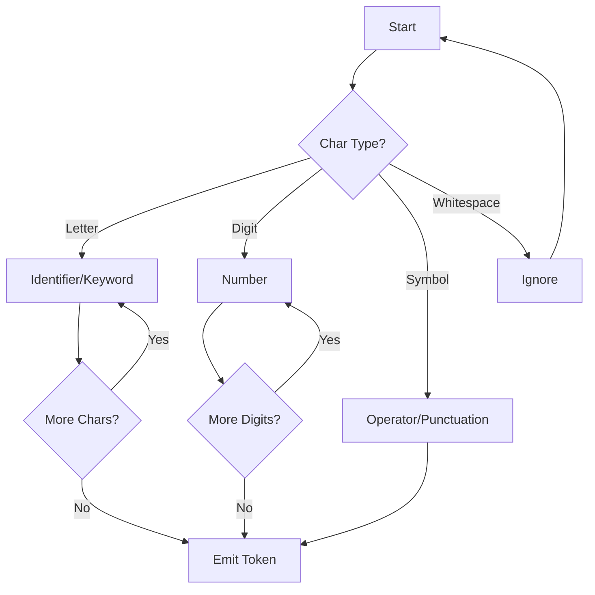
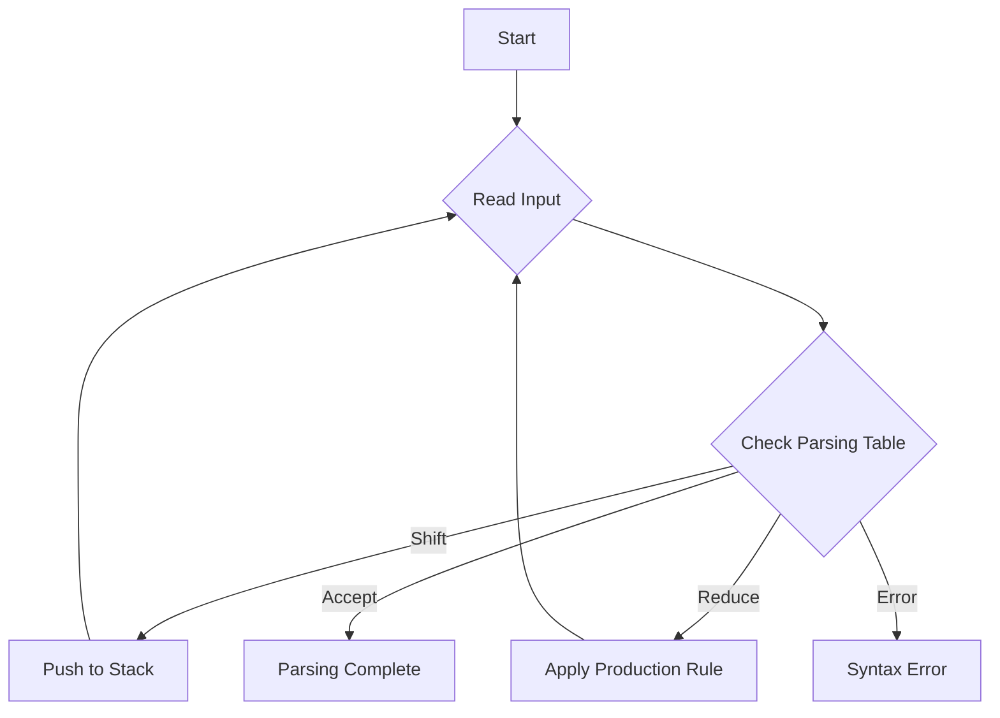

<style>
.scrollable-code {
    max-height: 400px;
    overflow-y: auto;
    margin-bottom: 20px;
}
.scrollable-code pre {
    margin: 0;
}
.output-table {
    width: 100%;
    border-collapse: collapse;
    margin-bottom: 20px;
}
.output-table th, .output-table td {
    border: 1px solid #ddd;
    padding: 8px;
    text-align: left;
}
.output-table th {
    background-color: #f2f2f2;
}
</style>


## Introduction

In the realm of compiler design, two crucial components stand out: the Lexical Analyzer and the Parser. This project dives deep into implementing both, using Java as our weapon of choice. Let's embark on this journey of transforming raw code into meaningful structures!

## Part 1: The Lexical Analyzer

### What is a Lexical Analyzer?

A lexical analyzer, often called a scanner or tokenizer, is the first phase of a compiler. It takes the raw input code and breaks it down into a sequence of tokens. Think of it as the first pass in understanding the structure of the code.

### Our Implementation

Our lexical analyzer is implemented in Java and can recognize a wide variety of tokens, including:

- Keywords
- Identifiers
- Literals (integer, floating-point, character, string)
- Operators
- Punctuation

### Implemenation Details
Here is the detailed implementaion of the lexical analyzer. Creadits goes to my colleague Khalid AL-Ghamdi <3.

<div class="scrollable-code">

```java

package javalexicalanalyzer;

import java.io.BufferedReader;
import java.io.File;
import java.io.FileNotFoundException;
import java.io.FileReader;
import java.io.IOException;
import java.io.PrintWriter;
import java.util.Scanner;


public class JavaLexicalAnalyzer {

    
    public static void main(String[] args) throws FileNotFoundException, IOException {
        tokenizer("input.txt"); //input can be changed from here
        System.out.println("Tokens have been identified successfully !!!");
        System.exit(0);
    }
    public static void tokenizer(String location) throws FileNotFoundException, IOException{
        if(!(new File(location).exists())){ 
            System.out.println("The Input File Does Not Exist");
            return;
        }
        char lexeme []= new char[30]; //to store lexeme to turn into token later
        int index=0; //the index of the char in the lexeme
        String currentLexeme; // to print the lexeme as a string later
        boolean keywordFlag=false; // true if identifier is a keyword
        char lookahead; //the character we are currently reading
        String keywords[]=new String [50]; //an array for keywords. note: we have 50 keywords registered in a file
        BufferedReader input = new BufferedReader(new FileReader(location)); //we will use BufferedReader to read char by char from the input file
        Scanner keywordScanner = new Scanner(new File("keywords.txt")); // we will use Scanner to read word by word from keywords file to store them in an array
        PrintWriter output = new PrintWriter("output.txt");
        int k=0;
        while(keywordScanner.hasNext()){ //storing keywords in an array
            keywords[k]= (String)keywordScanner.next();
            k++;
        }
        int state = 0; //start state (S state in the DFA)
        // BufferedReader will read char and return as integer, we need to type cast (char) to turn the integer to char
        int charNum; //BufferedReader will return -1 if end of file is reached, which why we need charNum to check 
        charNum=input.read();
        boolean lastRead=false; //without this the lexical analyzer will skip the very last rotation
        //because the last rotation will have charNum as -1 but the program didn't yet reach a final state
        while(charNum!=-1 || !lastRead){ //while end of file is not reached
            
            if(charNum==-1) // if true it will continue this loop but will exit next rotation
                lastRead=true;
            
            lookahead=(char)charNum; 
            switch(state){
                case 0: //start state
                    if(Character.isWhitespace(lookahead) || lookahead=='\n' || lookahead=='\t'){ //ignore whitespace, new line , and tab
                        state=0;
                        charNum=input.read(); // read next character
                        break;
                    }
                    else if(lookahead=='_'|| Character.isLetter(lookahead)|| lookahead=='$'){ //identifier
                        state=1;
                        lexeme[index++]=lookahead; //store lookahead in the lexeme array 
                        charNum=input.read();
                        break;
                    }
                    else if(Character.isDigit(lookahead)){ //digit literal (int or floating point)
                        state=3;
                        lexeme[index++]=lookahead;
                        charNum=input.read();
                        break;
                    }
                    else if(lookahead=='\''){  //character literal
                        state=7;
                        charNum=input.read();
                        break;
                    }
                    else if(lookahead=='\"'){  //String literal
                        state=9;
                        charNum=input.read();
                        break;
                    }
                    else if(lookahead=='/'){  //can be one line comment, multi-line comment, division, or division with assign
                        state=11;
                        lexeme[index++]=lookahead;
                        charNum=input.read();
                        break;
                    }
                    else if(lookahead=='+'){ // can be increment, plus , or plus with assign
                        state=17;
                        lexeme[index++]=lookahead;
                        charNum=input.read();
                        break;
                    }
                    else if(lookahead=='-'){ // can be decrement, subtract , or subtract with assign
                        state=21;
                        lexeme[index++]=lookahead;
                        charNum=input.read();
                        break;
                    }
                    else if(lookahead=='*'){ // multiplication, or multiplication with assign
                        state=25;
                        lexeme[index++]=lookahead;
                        charNum=input.read();
                        break;
                    }
                    else if(lookahead=='%'){ // modulus, or modulus with assign
                        state=28;
                        lexeme[index++]=lookahead;
                        charNum=input.read();
                        break;
                    }
                    else if(lookahead=='='){ //can be equal or assign
                        state=31;
                        lexeme[index++]=lookahead;
                        charNum=input.read();
                        break;
                    }
                    else if(lookahead=='|'){ //can be bitwise, logical , or with assign
                        state=34;
                        lexeme[index++]=lookahead;
                        charNum=input.read();
                        break;
                    }
                    else if(lookahead=='&'){ //can be bitwise, logical , or with assign
                        state=38;
                        lexeme[index++]=lookahead;
                        charNum=input.read();
                        break;
                    }
                    else if(lookahead=='!'){ // can be logical not or not equal 
                        state=42;
                        lexeme[index++]=lookahead;
                        charNum=input.read();
                        break;
                    }
                    else if(lookahead=='^'){ // can be bitwise XOR , or XOR with assign
                        state=45;
                        lexeme[index++]=lookahead;
                        charNum=input.read();
                        break;
                    }
                    else if(lookahead=='~'){ //bitwise complement
                        state=48;
                        lexeme[index++]=lookahead; //////////////////////////////////////////////////////////////////////////////////////
                        charNum=input.read();
                        break;
                    }
                    else if(lookahead=='>'){ //can be greater than, or right shift
                        state=49;
                        lexeme[index++]=lookahead;
                        charNum=input.read();
                        break;
                    }
                    else if(lookahead=='<'){ //can be less than, or left shift
                        state=58;
                        lexeme[index++]=lookahead;
                        charNum=input.read();
                        break;
                    }
                    else if(lookahead=='?'){
                        state=64;
                        lexeme[index++]=lookahead;
                        charNum=input.read();
                        break;
                    }
                    else if(lookahead==':'){
                        state=65;
                        lexeme[index++]=lookahead;
                        charNum=input.read();
                        break;
                    }
                    else if(lookahead==';'){
                        state=66;
                        lexeme[index++]=lookahead;
                        charNum=input.read();
                        break;
                    }
                    else if(lookahead==','){
                        state=67;
                        lexeme[index++]=lookahead;
                        charNum=input.read();
                        break;
                    }
                    else if(lookahead=='.'){
                        state=68;
                        lexeme[index++]=lookahead;
                        charNum=input.read();
                        break;
                    }
                    else if(lookahead=='('){
                        state=69;
                        lexeme[index++]=lookahead;
                        charNum=input.read();
                        break;
                    }
                    else if(lookahead==')'){
                        state=70;
                        lexeme[index++]=lookahead;
                        charNum=input.read();
                        break;
                    }
                    else if(lookahead=='['){
                        state=71;
                        lexeme[index++]=lookahead;
                        charNum=input.read();
                        break;
                    }
                    else if(lookahead==']'){
                        state=72;
                        lexeme[index++]=lookahead;
                        charNum=input.read();
                        break;
                    }
                    else if(lookahead=='{'){
                        state=73;
                        lexeme[index++]=lookahead;
                        charNum=input.read();
                        break;
                    }
                    else if(lookahead=='}'){
                        state=74;
                        lexeme[index++]=lookahead;
                        charNum=input.read();
                        break;
                    }
                    else if(lookahead=='\\'){ //backslash
                        state=75;
                        lexeme[index++]=lookahead;
                        charNum=input.read();
                        break;
                    }
                    else if(lookahead=='\b'){ //backspace
                        state=76;
                        lexeme[index++]=lookahead;
                        charNum=input.read();
                        break;
                    }
                    else{ //if a character is read which is not recognized by our tokenizer 
                        state=77;
                        charNum=input.read();
                        break;
                    }
                case 1:
                    if(lookahead=='_'|| Character.isLetter(lookahead) || Character.isDigit(lookahead) || lookahead=='$'){
                        state=1;
                        lexeme[index++]=lookahead;
                        charNum=input.read();
                        break;
                    }
                    else { // identifier is finished
                        state=2;
                        lexeme[index]='\0'; //store null (\0) after lexeme so we don't print after null
                        //charNum=input.read(); <-- we will not use this because we still want to use lookahead since it is not part of the identifier 
                        break;
                    }
                case 2:
                    state=0;
                    currentLexeme=""; // now it has nothing and will be filled with the characters of the lexeme in the next loop
                    for(int i=0;lexeme[i]!='\0';i++){ // from 0 untill null, null will not be printed
                        currentLexeme+= lexeme[i]; //add the character to the lexeme string 
                    }
                    
                    for(int i=0;i<keywords.length;i++){ //to check if identifier is a keyword
                        if(currentLexeme.equals(keywords[i])){
                            keywordFlag=true;
                            index=i; //save i to print the keyword later
                            break;
                        }
                    }
                    
                    if(keywordFlag){ //lexeme is a reserved word
                        output.printf("%s %30s %n",currentLexeme,keywords[index]);
                        keywordFlag=false;
                    }
                    else{
                        output.printf("%s %30s %n",currentLexeme,"ID");
                    }
                    index=0; // reset index for other lexemes
                    break;
                    
                case 3:
                    if(Character.isDigit(lookahead)){
                        state=3;
                        lexeme[index++]=lookahead;
                        charNum=input.read();
                        break;
                    }
                    else if(lookahead=='.'){ //it is a float point literal 
                        state=5;
                        lexeme[index++]=lookahead;
                        charNum=input.read();
                        break;
                    }
                    else { // integer literal 
                        state=4;
                        lexeme[index]='\0';
                        break;
                    }
                case 4:
                    state=0;
                    currentLexeme=""; 
                    for(int i=0;lexeme[i]!='\0';i++){
                        currentLexeme+= lexeme[i];
                    }
                    output.printf("%s %30s %n",currentLexeme,"Integer Literal");
                    index=0; // reset index for other lexemes
                    break;
                case 5:
                    if(Character.isDigit(lookahead)){
                        state=5;
                        lexeme[index++]=lookahead;
                        charNum=input.read();
                        break;
                    }
                    else {
                        state=6;
                        lexeme[index]='\0';
                        break;
                    }
                case 6:
                    state=0;
                    currentLexeme=""; 
                    for(int i=0;lexeme[i]!='\0';i++){
                        currentLexeme+= lexeme[i];
                    }
                    output.printf("%s %30s %n",currentLexeme,"Floating Point Literal");
                    index=0; // reset index for other lexemes
                    break;
                    
                case 7:
                    if(lookahead=='\''){
                        state=8;
                        lexeme[index]='\0';
                        charNum=input.read();
                        break;
                    }
                    else {
                        state=7;
                        lexeme[index++]=lookahead;
                        charNum=input.read();
                        break;
                    }
                case 8:
                    state=0;
                    currentLexeme=""; 
                    for(int i=0;lexeme[i]!='\0';i++){
                        currentLexeme+= lexeme[i];
                    }
                    output.printf("%s %30s %n",'\'',"Single Quote");
                    output.printf("%s %30s %n",currentLexeme,"Character Literal");
                    output.printf("%s %30s %n",'\'',"Single Quote");
                    index=0; // reset index for other lexemes
                    break;
                case 9:
                    if(lookahead=='\"'){
                        state=10;
                        lexeme[index]='\0';
                        charNum=input.read();
                        break;
                    }
                    else {
                        state=9;
                        lexeme[index++]=lookahead;
                        charNum=input.read();
                        break;
                    }
                case 10:
                    state=0;
                    currentLexeme=""; 
                    for(int i=0;lexeme[i]!='\0';i++){
                        currentLexeme+= lexeme[i];
                    }
                    output.printf("%s %30s %n",'\"',"Double Quote");
                    output.printf("%s %30s %n",currentLexeme,"String Literal");
                    output.printf("%s %30s %n",'\"',"Double Quote");
                    index=0; // reset index for other lexemes
                    break;
                case 11:
                    if(lookahead=='/'){ //one line comment
                        state=12;
                        break;
                    }
                    else if(lookahead=='*'){ // multi-line comment
                        state=13;
                        charNum=input.read();
                        break;
                    }
                    else if(lookahead=='='){ //division with assign
                        state=16;
                        lexeme[index++]=lookahead;
                        lexeme[index]='\0';
                        charNum=input.read();
                        break;
                    }
                    else{ //division
                        state = 15;
                        lexeme[index]='\0';
                        index=0;
                        break;
                    }
                case 12:
                    state=0;
                    input.readLine(); //skip the one line comment
                    charNum=input.read(); //read character from next line
                    index=0;
                    break;
                case 13:
                    if(lookahead=='*'){
                        state=14;
                        charNum=input.read();
                        break;
                    }
                    else {
                        state=13;
                        charNum=input.read();
                        break;
                    }
                case 14:
                    if(lookahead=='*'){
                        state=14;
                        charNum=input.read();
                        break;
                    }
                    else if(lookahead=='/'){
                        state=0;
                        index=0;
                        charNum=input.read();
                        break;
                    }
                    else {
                        state=13;
                        charNum=input.read();
                        break;
                    }
                case 15:
                    state=0;
//                    currentLexeme=""; 
//                    for(int i=0;lexeme[i]!='\0';i++){           <-- no need since we will print only '/'
//                        currentLexeme+= lexeme[i];
//                    }
                    output.printf("%s %30s %n",'/',"Division");
                    index=0; // reset index for other lexemes
                    break;
                case 16:
                    state=0;
                    currentLexeme=""; 
                    for(int i=0;lexeme[i]!='\0';i++){
                        currentLexeme+= lexeme[i];
                    }
                    output.printf("%s %30s %n",currentLexeme,"Division Assign");
                    index=0; // reset index for other lexemes
                    break;
                case 17:
                    if(lookahead=='+'){
                        state=18;
                        lexeme[index++]=lookahead;
                        lexeme[index]='\0';
                        charNum=input.read();
                        break;
                    }
                    else if(lookahead=='='){
                        state=19;
                        lexeme[index++]=lookahead;
                        lexeme[index]='\0';
                        charNum=input.read();
                        break;
                    }
                    else{
                        state=20;
                        lexeme[index]='\0';
                        break;
                    }
                case 18:
                    state=0;
                    currentLexeme=""; 
                    for(int i=0;lexeme[i]!='\0';i++){
                        currentLexeme+= lexeme[i];
                    }
                    output.printf("%s %30s %n",currentLexeme,"Increment");
                    index=0; // reset index for other lexemes
                    break;
                case 19:
                    state=0;
                    currentLexeme=""; 
                    for(int i=0;lexeme[i]!='\0';i++){
                        currentLexeme+= lexeme[i];
                    }
                    output.printf("%s %30s %n",currentLexeme,"Plus Assign");
                    index=0; // reset index for other lexemes
                    break;
                case 20:
                    state=0;
                    output.printf("%s %30s %n",'+',"Plus");
                    index=0; // reset index for other lexemes
                    break;
                case 21:
                    if(lookahead=='-'){
                        state=22;
                        lexeme[index++]=lookahead;
                        lexeme[index]='\0';
                        charNum=input.read();
                        break;
                    }
                    else if(lookahead=='='){
                        state=23;
                        lexeme[index++]=lookahead;
                        lexeme[index]='\0';
                        charNum=input.read();
                        break;
                    }
                    else{
                        state=24;
                        lexeme[index]='\0'; ///////////////////////////////////////////////////////////////////////////////////////////////////// check if necessary
                        break;
                    }
                case 22:
                    state=0;
                    currentLexeme=""; 
                    for(int i=0;lexeme[i]!='\0';i++){
                        currentLexeme+= lexeme[i];
                    }
                    output.printf("%s %30s %n",currentLexeme,"Decrement");
                    index=0; // reset index for other lexemes
                    break;
                case 23:
                    state=0;
                    currentLexeme=""; 
                    for(int i=0;lexeme[i]!='\0';i++){
                        currentLexeme+= lexeme[i];
                    }
                    output.printf("%s %30s %n",currentLexeme,"Subtract Assign");
                    index=0; // reset index for other lexemes
                    break;
                case 24:
                    state=0;
                    output.printf("%s %30s %n",'-',"Subtract");
                    index=0; // reset index for other lexemes
                    break;
                case 25:
                    if(lookahead=='='){
                        state=26;
                        lexeme[index++]=lookahead;
                        lexeme[index]='\0';
                        charNum=input.read();
                        break;
                    }
                    else{
                        state=27;
                        lexeme[index]='\0';
                        break;
                    }
                case 26:
                    state=0;
                    currentLexeme=""; 
                    for(int i=0;lexeme[i]!='\0';i++){
                        currentLexeme+= lexeme[i];
                    }
                    output.printf("%s %30s %n",currentLexeme,"Multiplication Assign");
                    index=0; // reset index for other lexemes
                    break;
                case 27:
                    state=0;
                    output.printf("%s %30s %n",'*',"Multiplication");
                    index=0; // reset index for other lexemes
                    break;
                case 28:
                    if(lookahead=='='){
                        state=29;
                        lexeme[index++]=lookahead;
                        lexeme[index]='\0';
                        charNum=input.read();
                        break;
                    }
                    else{
                        state=30;
                        lexeme[index]='\0';
                        break;
                    }
                case 29:
                    state=0;
                    currentLexeme=""; 
                    for(int i=0;lexeme[i]!='\0';i++){
                        currentLexeme+= lexeme[i];
                    }
                    output.printf("%s %30s %n",currentLexeme,"Modulus Assign");
                    index=0; // reset index for other lexemes
                    break;
                case 30:
                    state=0;
                    output.printf("%s %30s %n",'%',"Modulus");
                    index=0; // reset index for other lexemes
                    break;
                case 31:
                    if(lookahead=='='){
                        state=32;
                        lexeme[index++]=lookahead;
                        lexeme[index]='\0';
                        charNum=input.read();
                        break;
                    }
                    else{
                        state=33;
                        lexeme[index]='\0';
                        break;
                    }
                case 32:
                    state=0;
                    currentLexeme=""; 
                    for(int i=0;lexeme[i]!='\0';i++){
                        currentLexeme+= lexeme[i];
                    }
                    output.printf("%s %30s %n",currentLexeme,"Equal");
                    index=0; // reset index for other lexemes
                    break;
                case 33:
                    state=0;
                    output.printf("%s %30s %n",'=',"Assign");
                    index=0; // reset index for other lexemes
                    break;
                case 34:
                    if(lookahead=='='){
                        state=35;
                        lexeme[index++]=lookahead;
                        lexeme[index]='\0';
                        charNum=input.read();
                        break;
                    }
                    else if(lookahead=='|'){
                        state=36;
                        lexeme[index++]=lookahead;
                        lexeme[index]='\0';
                        charNum=input.read();
                        break;
                    }
                    else{
                        state=37;
                        lexeme[index]='\0';
                        break;
                    }
                case 35:
                    state=0;
                    currentLexeme=""; 
                    for(int i=0;lexeme[i]!='\0';i++){
                        currentLexeme+= lexeme[i];
                    }
                    output.printf("%s %30s %n",currentLexeme,"OR Assign");
                    index=0; // reset index for other lexemes
                    break;
                case 36:
                    state=0;
                    currentLexeme=""; 
                    for(int i=0;lexeme[i]!='\0';i++){
                        currentLexeme+= lexeme[i];
                    }
                    output.printf("%s %30s %n",currentLexeme,"Logical OR");
                    index=0; // reset index for other lexemes
                    break;
                case 37:
                    state=0;
                    output.printf("%s %30s %n",'|',"Bitwise OR");
                    index=0; // reset index for other lexemes
                    break;
                case 38:
                    if(lookahead=='='){
                        state=39;
                        lexeme[index++]=lookahead;
                        lexeme[index]='\0';
                        charNum=input.read();
                        break;
                    }
                    else if(lookahead=='&'){
                        state=40;
                        lexeme[index++]=lookahead;
                        lexeme[index]='\0';
                        charNum=input.read();
                        break;
                    }
                    else{
                        state=41;
                        lexeme[index]='\0';
                        break;
                    }
                case 39:
                    state=0;
                    currentLexeme=""; 
                    for(int i=0;lexeme[i]!='\0';i++){
                        currentLexeme+= lexeme[i];
                    }
                    output.printf("%s %30s %n",currentLexeme,"AND Assign");
                    index=0; // reset index for other lexemes
                    break;
                case 40:
                    state=0;
                    currentLexeme=""; 
                    for(int i=0;lexeme[i]!='\0';i++){
                        currentLexeme+= lexeme[i];
                    }
                    output.printf("%s %30s %n",currentLexeme,"Logical AND");
                    index=0; // reset index for other lexemes
                    break;
                case 41:
                    state=0;
                    output.printf("%s %30s %n",'&',"Bitwise AND");
                    index=0; // reset index for other lexemes
                    break;
                case 42:
                    if(lookahead=='='){
                        state=43;
                        lexeme[index++]=lookahead;
                        lexeme[index]='\0';
                        charNum=input.read();
                        break;
                    }
                    else{
                        state=44;
                        lexeme[index]='\0';
                        break;
                    }
                case 43:
                    state=0;
                    currentLexeme=""; 
                    for(int i=0;lexeme[i]!='\0';i++){
                        currentLexeme+= lexeme[i];
                    }
                    output.printf("%s %30s %n",currentLexeme,"Not Equal");
                    index=0; // reset index for other lexemes
                    break;
                case 44:
                    state=0;
                    output.printf("%s %30s %n",'!',"Logical NOT");
                    index=0; // reset index for other lexemes
                    break;
                case 45:
                    if(lookahead=='='){
                        state=46;
                        lexeme[index++]=lookahead;
                        lexeme[index]='\0';
                        charNum=input.read();
                        break;
                    }
                    else{
                        state=47;
                        lexeme[index]='\0';
                        break;
                    }
                case 46:
                    state=0;
                    currentLexeme=""; 
                    for(int i=0;lexeme[i]!='\0';i++){
                        currentLexeme+= lexeme[i];
                    }
                    output.printf("%s %30s %n",currentLexeme,"XOR Assign");
                    index=0; // reset index for other lexemes
                    break;
                case 47:
                    state=0;
                    output.printf("%s %30s %n",'^',"Bitwise XOR");
                    index=0; // reset index for other lexemes
                    break;
                case 48:
                    state=0;
                    output.printf("%s %30s %n",'~',"Bitwise Complement");
                    index=0; // reset index for other lexemes
                    break;
                case 49:
                    if(lookahead=='='){
                        state=50;
                        lexeme[index++]=lookahead;
                        lexeme[index]='\0';
                        charNum=input.read();
                        break;
                    }
                    else if(lookahead=='>'){
                        state=51;
                        lexeme[index++]=lookahead;
                        charNum=input.read();
                        break;
                    }
                    else{
                        state=57;
                        lexeme[index]='\0';
                        break;
                    }
                case 50:
                    state=0;
                    currentLexeme=""; 
                    for(int i=0;lexeme[i]!='\0';i++){
                        currentLexeme+= lexeme[i];
                    }
                    output.printf("%s %30s %n",currentLexeme,"Greater Than Or Equal");
                    index=0; // reset index for other lexemes
                    break;
                case 51:
                    if(lookahead=='='){
                        state=52;
                        lexeme[index++]=lookahead;
                        lexeme[index]='\0';
                        charNum=input.read();
                        break;
                    }
                    else if(lookahead=='>'){
                        state=53;
                        lexeme[index++]=lookahead;
                        charNum=input.read();
                        break;
                    }
                    else{
                        state=56;
                        lexeme[index]='\0';
                        break;
                    }
                case 52:
                    state=0;
                    currentLexeme=""; 
                    for(int i=0;lexeme[i]!='\0';i++){
                        currentLexeme+= lexeme[i];
                    }
                    output.printf("%s %30s %n",currentLexeme,"Signed Right Shift Assign");
                    index=0; // reset index for other lexemes
                    break;
                case 53:
                    if(lookahead=='='){
                        state=54;
                        lexeme[index++]=lookahead;
                        lexeme[index]='\0';
                        charNum=input.read();
                        break;
                    }
                    else{
                        state=55;
                        lexeme[index]='\0';
                        break;
                    }
                case 54:
                    state=0;
                    currentLexeme=""; 
                    for(int i=0;lexeme[i]!='\0';i++){
                        currentLexeme+= lexeme[i];
                    }
                    output.printf("%s %30s %n",currentLexeme,"Unsigned Right Shift Assign");
                    index=0; // reset index for other lexemes
                    break;
                case 55:
                    state=0;
                    currentLexeme=""; 
                    for(int i=0;lexeme[i]!='\0';i++){
                        currentLexeme+= lexeme[i];
                    }
                    output.printf("%s %30s %n",currentLexeme,"Unsigned Right Shift");
                    index=0; // reset index for other lexemes
                    break;
                case 56:
                    state=0;
                    currentLexeme=""; 
                    for(int i=0;lexeme[i]!='\0';i++){
                        currentLexeme+= lexeme[i];
                    }
                    output.printf("%s %30s %n",currentLexeme,"Signed Right Shift");
                    index=0; // reset index for other lexemes
                    break;
                case 57:
                    state=0;
                    output.printf("%s %30s %n",'>',"Unsigned Right Shift");
                    index=0; // reset index for other lexemes
                    break;
                case 58:
                    if(lookahead=='='){
                        state=59;
                        lexeme[index++]=lookahead;
                        lexeme[index]='\0';
                        charNum=input.read();
                        break;
                    }
                    else if(lookahead=='<'){
                        state=60;
                        lexeme[index++]=lookahead;
                        charNum=input.read();
                        break;
                    }
                    else{
                        state=63;
                        lexeme[index]='\0';
                        break;
                    }
                case 59:
                    state=0;
                    currentLexeme=""; 
                    for(int i=0;lexeme[i]!='\0';i++){
                        currentLexeme+= lexeme[i];
                    }
                    output.printf("%s %30s %n",currentLexeme,"Less Than Or Equal");
                    index=0; // reset index for other lexemes
                    break;
                case 60:
                    if(lookahead=='='){
                        state=61;
                        lexeme[index++]=lookahead;
                        lexeme[index]='\0';
                        charNum=input.read();
                        break;
                    }
                    else{
                        state=62;
                        lexeme[index]='\0';
                        break;
                    }
                case 61:
                    state=0;
                    currentLexeme=""; 
                    for(int i=0;lexeme[i]!='\0';i++){
                        currentLexeme+= lexeme[i];
                    }
                    output.printf("%s %30s %n",currentLexeme,"Signed Left Shift Assign");
                    index=0; // reset index for other lexemes
                    break;
                case 62:
                    state=0;
                    currentLexeme=""; 
                    for(int i=0;lexeme[i]!='\0';i++){
                        currentLexeme+= lexeme[i];
                    }
                    output.printf("%s %30s %n",currentLexeme,"Signed Left Shift");
                    index=0; // reset index for other lexemes
                    break;
                case 63:
                    state=0;
                    output.printf("%s %30s %n",'<',"Less Than");
                    index=0; // reset index for other lexemes
                    break;
                case 64:
                    state=0;
                    output.printf("%s %30s %n",'?',"Question Mark");
                    index=0; // reset index for other lexemes
                    break;
                case 65:
                    state=0;
                    output.printf("%s %30s %n",':',"Colon");
                    index=0; // reset index for other lexemes
                    break;
                case 66:
                    state=0;
                    output.printf("%s %30s %n",';',"Semicolon");
                    index=0; // reset index for other lexemes
                    break;
                case 67:
                    state=0;
                    output.printf("%s %30s %n",',',"Comma");
                    index=0; // reset index for other lexemes
                    break;
                case 68:
                    state=0;
                    output.printf("%s %30s %n",'.',"Dot");
                    index=0; // reset index for other lexemes
                    break;
                case 69:
                    state=0;
                    output.printf("%s %30s %n",'(',"Left Parenthesis");
                    index=0; // reset index for other lexemes
                    break;
                case 70:
                    state=0;
                    output.printf("%s %30s %n",')',"Right Parenthesis");
                    index=0; // reset index for other lexemes
                    break;
                case 71:
                    state=0;
                    output.printf("%s %30s %n",'[',"Left Square Bracket");
                    index=0; // reset index for other lexemes
                    break;
                case 72:
                    state=0;
                    output.printf("%s %30s %n",']',"Right Square Bracket");
                    index=0; // reset index for other lexemes
                    break;
                case 73:
                    state=0;
                    output.printf("%s %30s %n",'{',"Left Curly Brace");
                    index=0; // reset index for other lexemes
                    break;
                case 74:
                    state=0;
                    output.printf("%s %30s %n",'}',"Right Curly Brace");
                    index=0; // reset index for other lexemes
                    break;
                case 75:
                    state=0;
                    output.printf("%s %30s %n",'\\',"Backslash");
                    index=0; // reset index for other lexemes
                    break;
                case 76:
                    state=0;
                    output.printf("%s %30s %n",'\b',"Backspace");
                    index=0; // reset index for other lexemes
                    break;
                case 77: //it is not a recognized character
                    state=0;
                    error(output);
                    index=0; // reset index for other lexemes
                    break;
                
            }
            output.flush();
        }
        output.close();
        input.close();
        
        
    }
    public static void error(PrintWriter out){
        out.println("UNRECOGNIZED TOKEN !!!");
    }
    
}

```
</div>

### The Heart of the Analyzer

The core of our lexical analyzer is a state machine. Here's a simplified visualization of how it works:



### Sample Input and Output

Let's see our lexical analyzer in action with this input:

```java
//This is sample comment
void main(){
int a,b,c;
a=b+++10;
char x='c';
/* This
is 
a
multiline
comment
*/
if (a<b || b==20.5){
	string v="Welcome";
}
}
```

Output (simplified):

<div class="scrollable-code">
<table class="output-table">
    <tr>
        <th>Token</th>
        <th>Lexeme</th>
    </tr>
    <tr><td>KEYWORD</td><td>void</td></tr>
    <tr><td>IDENTIFIER</td><td>main</td></tr>
    <tr><td>LEFT_PARENTHESIS</td><td>(</td></tr>
    <tr><td>RIGHT_PARENTHESIS</td><td>)</td></tr>
    <tr><td>LEFT_CURLY_BRACE</td><td>{</td></tr>
    <tr><td>KEYWORD</td><td>int</td></tr>
    <tr><td>IDENTIFIER</td><td>a</td></tr>
    <tr><td>COMMA</td><td>,</td></tr>
    <tr><td>IDENTIFIER</td><td>b</td></tr>
    <tr><td>COMMA</td><td>,</td></tr>
    <tr><td>IDENTIFIER</td><td>c</td></tr>
    <tr><td>SEMICOLON</td><td>;</td></tr>
    <tr><td>IDENTIFIER</td><td>a</td></tr>
    <tr><td>ASSIGN</td><td>=</td></tr>
    <tr><td>IDENTIFIER</td><td>b</td></tr>
    <tr><td>INCREMENT</td><td>++</td></tr>
    <tr><td>PLUS</td><td>+</td></tr>
    <tr><td>INTEGER_LITERAL</td><td>10</td></tr>
    <tr><td>SEMICOLON</td><td>;</td></tr>
    <tr><td>KEYWORD</td><td>char</td></tr>
    <tr><td>IDENTIFIER</td><td>x</td></tr>
    <tr><td>ASSIGN</td><td>=</td></tr>
    <tr><td>CHAR_LITERAL</td><td>'c'</td></tr>
    <tr><td>SEMICOLON</td><td>;</td></tr>
    <tr><td>KEYWORD</td><td>if</td></tr>
    <tr><td>LEFT_PARENTHESIS</td><td>(</td></tr>
    <tr><td>IDENTIFIER</td><td>a</td></tr>
    <tr><td>LESS_THAN</td><td><</td></tr>
    <tr><td>IDENTIFIER</td><td>b</td></tr>
    <tr><td>LOGICAL_OR</td><td>||</td></tr>
    <tr><td>IDENTIFIER</td><td>b</td></tr>
    <tr><td>EQUAL</td><td>==</td></tr>
    <tr><td>FLOAT_LITERAL</td><td>20.5</td></tr>
    <tr><td>RIGHT_PARENTHESIS</td><td>)</td></tr>
    <tr><td>LEFT_CURLY_BRACE</td><td>{</td></tr>
    <tr><td>KEYWORD</td><td>string</td></tr>
    <tr><td>IDENTIFIER</td><td>v</td></tr>
    <tr><td>ASSIGN</td><td>=</td></tr>
    <tr><td>STRING_LITERAL</td><td>"Welcome"</td></tr>
    <tr><td>SEMICOLON</td><td>;</td></tr>
    <tr><td>RIGHT_CURLY_BRACE</td><td>}</td></tr>
    <tr><td>RIGHT_CURLY_BRACE</td><td>}</td></tr>
</table>
</div>

## Part 2: The SLR Parser

### What is an SLR Parser?

An SLR (Simple LR) Parser is a bottom-up parser for a subset of context-free languages. It's more powerful than simple precedence parsers but less complex than LALR or Canonical LR parsers.

### Our Implementation

Our SLR Parser uses a parsing table to decide its actions. Here's a simplified view of how it works:



### Detailed Implementaion

<div class="scrollable-code">

```java
//class with main method
//importing the necessary packages
import java.util.*;
import java.io.*;

public class SLR_Parser{
    public static void main(String[] args) throws FileNotFoundException{
        //hashtable to store the parsing table
        Hashtable<String, String> table = new Hashtable<String, String>();
        //hashtable to store the productions
        Hashtable<String, String> productions = new Hashtable<String, String>();
        //inserting the productions into the hashtable
        productions.put("E", "E + T");
        productions.put("E", "T");
        productions.put("T", "T * F");
        productions.put("T", "F");
        productions.put("F", "( E )");
        productions.put("F", "id");
        //grammer rules into hashtable to help printing the action
        Hashtable<String, String> grammer = new Hashtable<String, String>();
        grammer.put("r1", "Reduce by E -> E + T");
        grammer.put("r2", "Reduce by E -> T");
        grammer.put("r3", "Reduce by T -> T * F");
        grammer.put("r4", "Reduce by T -> F");
        grammer.put("r5", "Reduce by F -> ( E )");
        grammer.put("r6", "Reduce by F -> id");
        //shift rules into hashtable to help printing the action
        grammer.put("s1", "shift 1");
        grammer.put("s2", "shift 2");
        grammer.put("s3", "shift 3");
        grammer.put("s4", "shift 4");
        grammer.put("s5", "shift 5");
        grammer.put("s6", "shift 6");
        grammer.put("s7", "shift 7");
        grammer.put("s8", "shift 8");
        grammer.put("s9", "shift 9");
        grammer.put("s10", "shift 10");
        grammer.put("s11", "shift 11");
        grammer.put("accept", "accept");

        //inserting the parsing table into the hashtable
        table.put("0id", "s5");
        table.put("0(", "s4");
        table.put("0E", "1");
        table.put("0T", "2");
        table.put("0F", "3");
        table.put("1+", "s6");
        table.put("1$", "accept");
        table.put("2+", "r2");
        table.put("2*", "s7");
        table.put("2)", "r2");
        table.put("2$", "r2");
        table.put("3+", "r4");
        table.put("3*", "r4");
        table.put("3)", "r4");
        table.put("3$", "r4");
        table.put("4id", "s5");
        table.put("4(", "s4");
        table.put("4E", "8");
        table.put("4T", "2");
        table.put("4F", "3");
        table.put("5+", "r6");
        table.put("5*", "r6");
        table.put("5)", "r6");
        table.put("5$", "r6");
        table.put("6id", "s5");
        table.put("6(", "s4");
        table.put("6T", "9");
        table.put("6F", "3");
        table.put("7id", "s5");
        table.put("7(", "s4");
        table.put("7F", "10");
        table.put("8+", "s6");
        table.put("8)", "s11");
        table.put("9+", "r1");
        table.put("9*", "s7");
        table.put("9)", "r1");
        table.put("9$", "r1");
        table.put("10+", "r3");
        table.put("10*", "r3");
        table.put("10)", "r3");
        table.put("10$", "r3");
        table.put("11+", "r5");
        table.put("11*", "r5");
        table.put("11)", "r5");
        table.put("11$", "r5");
        //read the input from an input file called input.txt
        File file = new File("input.txt");
        //scanner to read the input file
        Scanner in = new Scanner(file);
        while(in.hasNextLine()){
        //creating a stack
        Stack<String> stack = new Stack<String>();
        //pushing the initial state into the stack
        stack.push("0");

        
        //input string
        String input = in.nextLine();
        //index of the input string
        Parser(input, stack, table, productions, grammer);

    }
    }
    //method to parse the input string
    public static void Parser(String input, Stack<String> stack,Hashtable<String, String> table, Hashtable<String, String> productions, Hashtable<String, String> grammer){
        int index = 0;
        //print the stack and current input and action as a table format, each row is separated by a line of dashes
        System.out.println("----------------------------------------------------------------------------------------");
        System.out.println("Stack\t\t\t\t\t\tInput\t\t\t\tAction");
        System.out.println("----------------------------------------------------------------------------------------");   
        //System.out.printf("%-45s%-35s%-20s\n", stack, input, " ");     
        //while loop to go through the input string, shift and reduce, considering the parsing table, and consider id as a single token, and $ as the end of the input
        while(index < input.length()){
            //getting the current state from the stack
            String state = stack.peek();
            //getting the current input from the input string, it doesn't stop until space
            String current = "";
            while(index < input.length() && input.charAt(index) != ' '){
                current += input.charAt(index);
                index++;
            }
            //getting the action from the parsing table
            String action = table.get(state + current);

            System.out.printf("%-45s%-35s%-20s\n", stack, current+input.substring(index), grammer.get(action));

            //if the action is null, then the input is invalid
            if(action == null){
                System.out.println("Syntax Error");
                break;
            }
            //if the action is accept, then the input is valid
            else if(action.equals("accept")){
                break;
            }
            //if the action is shift, then push the current input and the next state into the stack
            else if(action.charAt(0) == 's'){
                stack.push(current);
                stack.push(action.substring(1));
                index++;
            }
            //if the action is reduce, then pop the stack as twice as the length of the white spaces in production rule, then push the non-terminal and the next state into the stack
            else if(action.charAt(0) == 'r'){
                int length = 0;
                char nonTerminal = ' ';
                //if the production rule is E->T, then the length is 1
                if(action.charAt(1) == '2'){
                    length = 1;
                    nonTerminal = 'E';
                }
                //if the production rule is E->E+T, then the length is 3
                else if(action.charAt(1) == '1'){
                    length = 3;
                    nonTerminal = 'E';
                }
                //if the production rule is T->F, then the length is 1
                else if(action.charAt(1) == '4'){
                    length = 1;
                    nonTerminal = 'T';
                }
                //if the production rule is T->T*F, then the length is 3
                else if(action.charAt(1) == '3'){
                    length = 3;
                    nonTerminal = 'T';
                }
                //if the production rule is F->id, then the length is 1
                else if(action.charAt(1) == '6'){
                    length = 1;
                    nonTerminal = 'F';
                }
                //if the production rule is F->(E), then the length is 3
                else if(action.charAt(1) == '5'){
                    length = 3;
                    nonTerminal = 'F';
                }
                //pop the stack as twice as the length of the white spaces in production rule
                for(int i = 0; i < length * 2; i++){
                    stack.pop();
                }
                //push the non-terminal and the next state into the stack
                String nextState = stack.peek()+nonTerminal;
                //print nextState
                stack.push(nonTerminal + "");
                stack.push(table.get(nextState));
            
            index--;
            
            
        }
        
    }
    System.out.println("----------------------------------------------------------------------------------------");    
}
}
```
</div>


### The Parsing Table

The heart of our SLR Parser is its parsing table. Here's a glimpse of how it's structured:

```java
table.put("0id", "s5");
table.put("0(", "s4");
table.put("0E", "1");
table.put("0T", "2");
table.put("0F", "3");
// ... more entries ...
```

### Sample Input and Output

Let's see our SLR Parser in action with these inputs:

1. `id * ( id + id ) $`
2. `( id + id ) * id $`

For the input: 
`id * ( id + id ) $`

<div class="scrollable-code">
<table class="output-table">
    <tr>
        <th>Stack</th>
        <th>Input</th>
        <th>Action</th>
    </tr>
    <tr><td>0</td><td>id*(id+id)$</td><td>Shift 5</td></tr>
    <tr><td>0 id 5</td><td>*(id+id)$</td><td>Reduce by F -> id</td></tr>
    <tr><td>0 F 3</td><td>*(id+id)$</td><td>Reduce by T -> F</td></tr>
    <tr><td>0 T 2</td><td>*(id+id)$</td><td>Shift 7</td></tr>
    <tr><td>0 T 2 * 7</td><td>(id+id)$</td><td>Shift 4</td></tr>
    <tr><td>0 T 2 * 7 ( 4</td><td>id+id)$</td><td>Shift 5</td></tr>
    <tr><td>0 T 2 * 7 ( 4 id 5</td><td>+id)$</td><td>Reduce by F -> id</td></tr>
    <tr><td>0 T 2 * 7 ( 4 F 3</td><td>+id)$</td><td>Reduce by T -> F</td></tr>
    <tr><td>0 T 2 * 7 ( 4 T 2</td><td>+id)$</td><td>Shift 6</td></tr>
    <tr><td>0 T 2 * 7 ( 4 T 2 + 6</td><td>id)$</td><td>Shift 5</td></tr>
    <tr><td>0 T 2 * 7 ( 4 T 2 + 6 id 5</td><td>)$</td><td>Reduce by F -> id</td></tr>
    <tr><td>0 T 2 * 7 ( 4 T 2 + 6 F 3</td><td>)$</td><td>Reduce by T -> F</td></tr>
    <tr><td>0 T 2 * 7 ( 4 T 2 + 6 T 9</td><td>)$</td><td>Reduce by E -> T + T</td></tr>
    <tr><td>0 T 2 * 7 ( 4 E 8</td><td>)$</td><td>Shift 11</td></tr>
    <tr><td>0 T 2 * 7 ( 4 E 8 ) 11</td><td>$</td><td>Reduce by F -> ( E )</td></tr>
    <tr><td>0 T 2 * 7 F 10</td><td>$</td><td>Reduce by T -> T * F</td></tr>
    <tr><td>0 T 2</td><td>$</td><td>Reduce by E -> T</td></tr>
    <tr><td>0 E 1</td><td>$</td><td>Accept</td></tr>
</table>
</div>

For the input: 
`( id + id ) * id $`

<div class="scrollable-code">
<table class="output-table">
    <tr>
        <th>Stack</th>
        <th>Input</th>
        <th>Action</th>
    </tr>
    <tr><td>0</td><td>(id+id)*id$</td><td>Shift 4</td></tr>
    <tr><td>0 ( 4</td><td>id+id)*id$</td><td>Shift 5</td></tr>
    <tr><td>0 ( 4 id 5</td><td>+id)*id$</td><td>Reduce by F -> id</td></tr>
    <tr><td>0 ( 4 F 3</td><td>+id)*id$</td><td>Reduce by T -> F</td></tr>
    <tr><td>0 ( 4 T 2</td><td>+id)*id$</td><td>Shift 6</td></tr>
    <tr><td>0 ( 4 T 2 + 6</td><td>id)*id$</td><td>Shift 5</td></tr>
    <tr><td>0 ( 4 T 2 + 6 id 5</td><td>)*id$</td><td>Reduce by F -> id</td></tr>
    <tr><td>0 ( 4 T 2 + 6 F 3</td><td>)*id$</td><td>Reduce by T -> F</td></tr>
    <tr><td>0 ( 4 T 2 + 6 T 9</td><td>)*id$</td><td>Reduce by E -> T + T</td></tr>
    <tr><td>0 ( 4 E 8</td><td>)*id$</td><td>Shift 11</td></tr>
    <tr><td>0 ( 4 E 8 ) 11</td><td>*id$</td><td>Reduce by F -> ( E )</td></tr>
    <tr><td>0 F 3</td><td>*id$</td><td>Reduce by T -> F</td></tr>
    <tr><td>0 T 2</td><td>*id$</td><td>Shift 7</td></tr>
    <tr><td>0 T 2 * 7</td><td>id$</td><td>Shift 5</td></tr>
    <tr><td>0 T 2 * 7 id 5</td><td>$</td><td>Reduce by F -> id</td></tr>
    <tr><td>0 T 2 * 7 F 10</td><td>$</td><td>Reduce by T -> T * F</td></tr>
    <tr><td>0 T 2</td><td>$</td><td>Reduce by E -> T</td></tr>
    <tr><td>0 E 1</td><td>$</td><td>Accept</td></tr>
</table>
</div>

## Conclusion

Building a lexical analyzer and SLR parser from scratch provides deep insights into how compilers work. This project demonstrates the power of Java in implementing complex language processing tools.

## Future Enhancements

1. Extend the lexical analyzer to support more complex tokens
2. Implement error recovery in the SLR parser
3. Develop a semantic analyzer as the next step in building a complete compiler

Remember, in the world of compiler design, we're not just writing code; we're creating the tools that understand code!